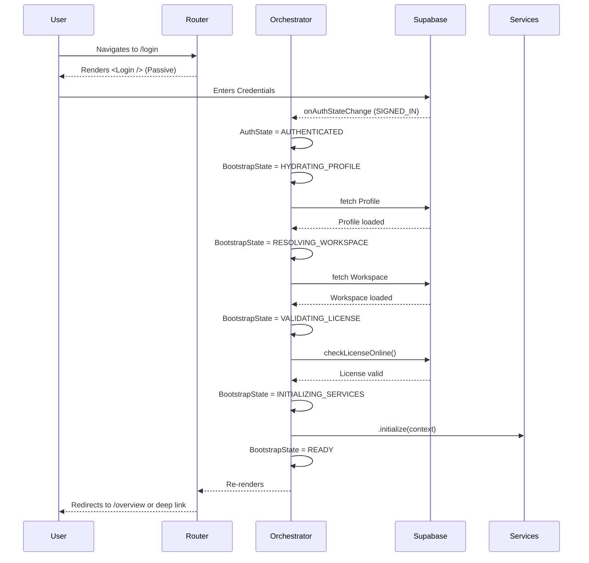
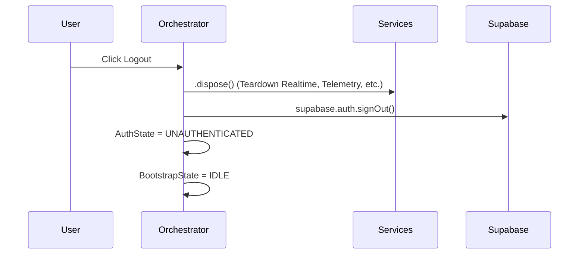

# Authentication & Application Bootstrap Architecture

This document describes the foundational architecture of the authentication and application startup sequence in Resolve PM. It is a mandatory reference for any engineer working on authentication, initialization, or routing.

## System Overview

The legacy architecture relied on implicit, loosely coupled side-effects (e.g. `useEffect` in `AuthContext` triggering `WorkspaceContext` which triggered licensing checks). This was error-prone, caused duplicate network requests, and created race conditions.

The new architecture introduces a **Deterministic Finite State Machine (FSM)** coordinated by a single `BootstrapOrchestrator`.

### Core Responsibilities

- **`BootstrapOrchestrator`**: The single source of truth for application startup. It reads from `supabase.auth` and strictly drives the sequence from Booting -> Authenticating -> Hydrating Profile -> Resolving Workspace -> Validating License -> Initializing Services -> Ready. It owns orchestration ONLY (never mutates users, only determines the next state).
- **Database (`handle_new_user`)**: Responsible ONLY for structural integrity. It guarantees every `auth.users` row has a matching `public.users` row (placeholder) and nothing else. It MUST NOT contain business workflows.
- **Provisioning Layer (Edge Functions & Reconciliation Services)**: Owns ALL business rules: invitation reconciliation, workspace assignment, role assignment, product key provisioning, invitation acceptance, owner onboarding, and audit events. There is ONE canonical implementation of invitation reconciliation.
- **Router (`router.tsx`)**: Completely passive rendering only. It reads `AuthState` and `BootstrapState` and renders the appropriate view. It performs no redirects via side-effects during the boot phase.
- **`AuthContext` / `WorkspaceContext`**: Pure state containers. They do not initiate API calls or listen to Auth events. They only hold data pushed into them by the Orchestrator.
- **Background Services**: Wrap long-running tasks (like realtime engines, telemetry, polling) in the `LifecycleAwareService` interface. The Orchestrator dictates exactly when they start, pause, resume, and die.

---

## State Machines

We track two explicit state variables:

### 1. `AuthState`
Answers: **"Who is the user?"**
- `BOOTING`: Supabase session is being read from browser.
- `AUTHENTICATING`: Actively checking credentials/tokens against backend.
- `AUTHENTICATED`: Valid user session exists.
- `UNAUTHENTICATED`: No valid session exists.
- `SESSION_EXPIRED`: The session lapsed or was revoked.
- `ERROR`: A fatal failure occurred during auth.

### 2. `BootstrapState`
Answers: **"Is the application ready?"**
- `IDLE`: Not started (usually mapped to `AuthState.BOOTING`).
- `HYDRATING_PROFILE`: Fetching user role, metadata, and preferences.
- `RESOLVING_WORKSPACE`: Validating the active workspace ID.
- `VALIDATING_LICENSE`: Confirming the Product Key is active.
- `PENDING_ONBOARDING`: User authenticated but needs to set up a workspace.
- `LICENSE_ACTIVATION`: Workspace exists but license is invalid; prompts Product Key Gate.
- `INITIALIZING_SERVICES`: Starting background telemetry, realtime engines, etc.
- `READY`: The application is fully booted and operational modules can safely render.
- `ERROR`: A fatal boot error occurred.

---

## Sequence Diagrams

### First Login Flow



### Logout Flow



---

## Lifecycle-Aware Services

All long-running background tasks (e.g., `TelemetryService`, `PresenceService`, `notificationEngine`) must implement `LifecycleAwareService`:

```typescript
export interface LifecycleAwareService {
  initialize(context: AppContext): void;
  pause(): void;
  resume(): void;
  dispose(): void;
  getStatus?(): 'idle' | 'running' | 'paused' | 'error';
}
```

The Orchestrator explicitly calls `initialize()` when `BootstrapState.INITIALIZING_SERVICES` is reached, and calls `dispose()` when the component unmounts or upon logout.

---

## Failure Scenarios

- **Network Unavailable**: The orchestrator handles offline fallback gracefully (e.g., if license validation fails due to network, it falls back to the last known state rather than hard-failing to the Product Gate).
- **Invalid License**: If `VALIDATING_LICENSE` fails for licensing reasons (expired, revoked), the FSM transitions to `LICENSE_ACTIVATION`. The router then renders the `<ProductKeyGate />`. Authentication is *not* destroyed.
- **Corrupted Profile**: If the profile cannot be hydrated (e.g. database error), the FSM transitions to `BootstrapState.ERROR`, halting the boot and preventing cascading failures in operational modules.

---

## Developer Guidelines

1. **NEVER read authentication from browser storage.** (`localStorage.getItem('supabase.auth.token')`). Always use `useAuth()` or `useBootstrap()`.
2. **NEVER initialize background services outside the orchestrator.** No `setInterval` or `supabase.channel()` calls should exist at the root level of a module.
3. **NEVER perform bootstrap logic inside the router.** The router must remain passive. It only looks at the state and returns JSX.
4. **NEVER add new loading booleans** (e.g. `isTeamLoading`). If a new global prerequisite is needed, extend the `BootstrapState` enum and add it to the Orchestrator pipeline.
5. **DO NOT dispatch redirects in nested components.** Redirects belong at the Router level, based entirely on the FSM state.
